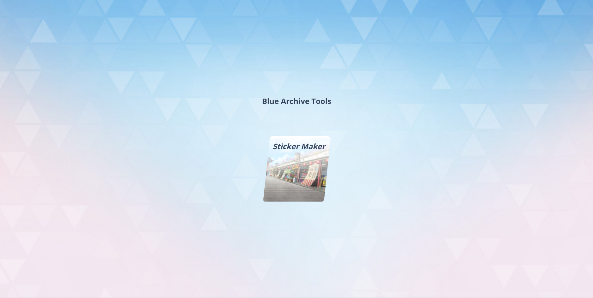

# Blue Archive Tools



Hey there! Welcome to our collection of fun tools for Blue Archive fans.

## 🚀 Check It Out!

[Blue Archive Tools Live Demo](https://ba-tools-plum.vercel.app/)

## 📝 What's This All About?

We created Blue Archive Tools as a passion project for fellow Blue Archive players. Right now, we've got a pretty cool Sticker Maker up and running, and we're excited to add more stuff like a Momotalk Generator and Music Archive soon!

## ✨ What Can You Do With It?

### 🎨 Sticker Maker

- **Pick Your Character**: We've included tons of your favorite Blue Archive characters
- **Add Your Text**: Type whatever you want and make it look just right
- **Move Stuff Around**: Use sliders or just drag things where you want them
- **Make It Pretty**: Change the font size, spacing, colors, and add outlines
- **Get Creative with Layout**: Put text behind characters, rotate it, change backgrounds
- **Save It**: Just hit download and your sticker is ready to share!

### 💬 Momotalk Simulator (Coming Soon)

- Create your own Momotalk conversations with your favorite characters

### 🎵 Music Archive (Coming Soon)

- Listen to all those catchy Blue Archive tunes in one place

## 🛠️ How We Built It

So you're curious about the tech? Here's what we used:

### The Building Blocks

- **Next.js 14**: This powerhouse let us create both server and client components
- **TypeScript**: Helps us catch bugs before they happen
- **Tailwind CSS**: Made styling super quick and consistent
- **Radix UI**: Gave us accessible components that we could customize
- **Lucide Icons**: These icons just look nice, don't they?

### Making It Look Good

- **Custom Components**: We built everything to fit the Blue Archive vibe
- **Works Everywhere**: Use it on your phone, tablet, or computer
- **Consistent Look**: Everything follows the same style guide

### Keeping It Secure

- **Supabase Auth**: Log in with your Google account

### Getting It Online

- **Vercel**: Handles all the hosting magic for us

## 📂 Project Structure

```
app/
├── (main)/                # Main application routes
│   ├── momotalk/          # Momotalk simulator
│   ├── music/             # Music archive
│   └── sticker/           # Sticker maker
├── @modal/                # Intercepting routes for modals
├── components/            # Reusable UI components
│   ├── auth/              # Authentication components
│   ├── layouts/           # Layout components
│   ├── momotalk/          # Momotalk-specific components
│   ├── music/             # Music-related components
│   ├── sticker/           # Sticker maker components
│   └── ui/                # Base UI components
├── config/                # Application configurations
├── data/                  # Static data for the application
├── lib/                   # Utility functions and services
│   ├── auth/              # Authentication utilities
│   └── supabase/          # Supabase client config
├── providers/             # React context providers
└── styles/                # Global styles
```

## 🎯 Core Functionality

The Sticker Maker allows users to:

1. Select a character from the Blue Archive universe
2. Add custom text with various styling options
3. Position and rotate text using intuitive controls
4. Download the finished sticker as a PNG file

## 🖌️ Canvas Implementation

The application uses a custom Canvas component that:

- Renders characters and text on an HTML5 canvas
- Provides real-time preview while editing
- Supports transparent backgrounds for versatile use

## 📱 Responsive Design

The application is fully responsive with:

- Mobile-optimized controls using tabs interface
- Desktop layout with side-by-side preview and controls
- Adaptive canvas sizing based on screen dimensions

## 🔒 Authentication

User authentication is implemented using:

- Supabase Authentication
- Google OAuth provider
- Server-side session management

## 🚀 Want to Run It Locally?

### What You'll Need

- Node.js 18+
- npm, yarn, or pnpm

### Step-by-Step Setup

1. Grab the code

```bash
git clone https://github.com/TraFost/ba-tools.git
cd blue-archive-tools
```

2. Install all the goodies

```bash
npm install
# or
yarn install
# or
pnpm install
```

3. Create your secret sauce
   Make a `.env` file with these ingredients:

```
SUPABASE_PROJECT_URL=your_supabase_url
SUPABASE_API_KEY=your_supabase_key
SUPABASE_DB_PASSWORD=your_db_password
SUPABASE_CALLBACK_URL=your_callback_url
GOOGLE_CLIENT_ID=your_google_client_id
GOOGLE_CLIENT_SECRET=your_google_client_secret
```

4. Fire it up!

```bash
npm run dev
# or
yarn dev
# or
pnpm run dev
```

5. Head to [http://localhost:3000](http://localhost:3000) and have fun!

## 📝 License

This project is licensed under the MIT License - see the LICENSE file for details.

## 👥 Contributors

- [Galih Aditya Dwisevi](https://github.com/samsulpanjul) - Original Idea & Contributor
- [Rahman Nurudin](https://github.com/TraFost) - Contributor

## 🙏 Acknowledgements

- Blue Archive game by Nexon and Yostar
- All the amazing art creators from the Blue Archive community

---

**Note**: Blue Archive Tools is a fan-made project and is not affiliated with Nexon or Yostar.
